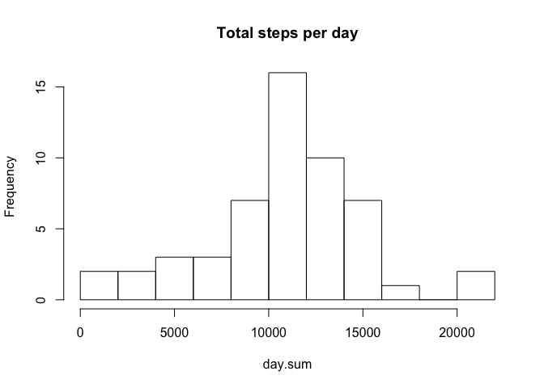
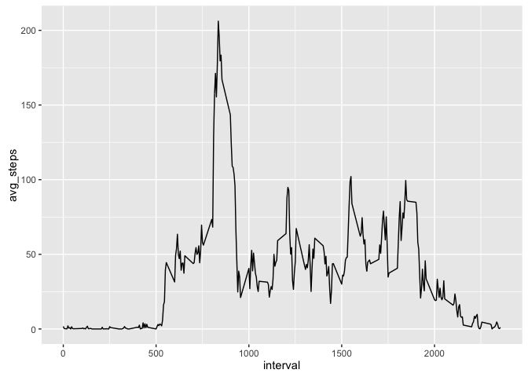
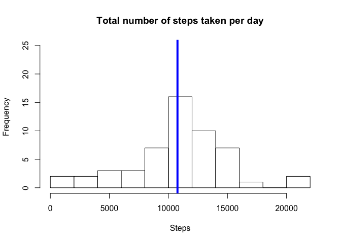
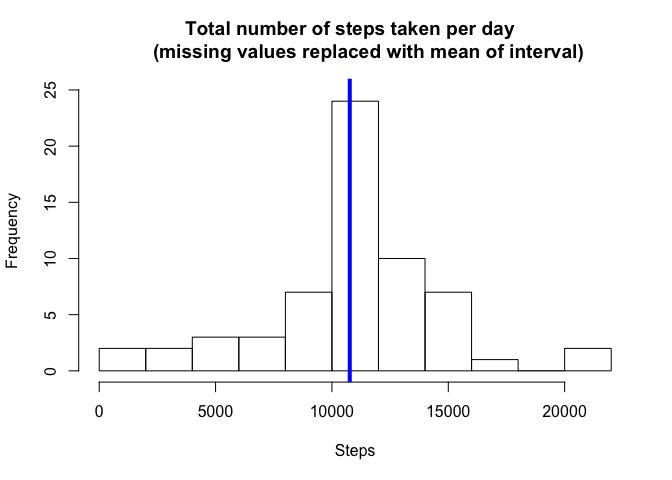
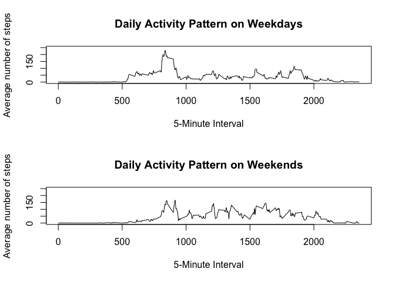

# Reproducible Research: Peer Assessment 1


## Loading and preprocessing the data

```
## 'data.frame':	17568 obs. of  3 variables:
##  $ steps   : num  NA NA NA NA NA NA NA NA NA NA ...
##  $ date    : Date, format: "2012-10-01" "2012-10-01" ...
##  $ interval: num  0 5 10 15 20 25 30 35 40 45 ...
```
## What is mean total number of steps taken per day?


The mean steps taken per day is 1.0766189\times 10^{4} steps and the median amount of steps taken per day is 1.0765\times 10^{4} steps.

## What is the average daily activity pattern?


```
## [1] 206.1698
```
The iterval 835 has the highest average amount of steps. There is on average 206.1698113 steps.  

## Imputing missing values

```
## [1] 0
```



```
## [1] 10766.19
```

```
## [1] 10766.19
```

```
## [1] 0
```

```
## [1] 1.188679
```

There are 2304 observations missing. The mean steps taken per day, with the NA values replaced with the interval average, is 1.0766189\times 10^{4} steps and the median steps taken is 1.0766189\times 10^{4}. There is no difference between the average steps taken per day when NA's are replaced, and about a one step difference in the median.

## Are there differences in activity patterns between weekdays and weekends?

